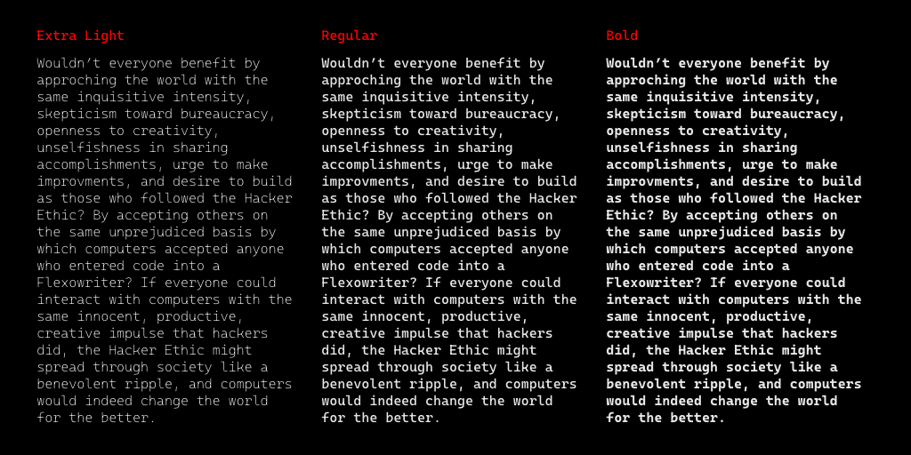

# Caskaydia Cove
Caskaydia Cove is a fork of the [Cascadia Code](https://github.com/microsoft/cascadia-code) typeface with the [RFN (Reserved Font Name)](https://scripts.sil.org/cms/scripts/page.php?site_id=nrsi&id=OFL_web_fonts_and_RFNs) removed, plus small adjustments to conform to the [Google Fonts spec](https://github.com/googlefonts/gf-docs/tree/master/Spec). The name comes from the [Nerds Fonts](https://github.com/ryanoasis/nerd-fonts) project, which uses “Caskaydia Cove” for its patched version of Casdadia Code. The RFN prevents distributing modified versions of fonts under the names used by their upstream maintainers, so if you are looking for something like Cascadia Code that can be modified for inclusion in various font collections without a name change, this repository might be what you are looking for.

This fork is maintained by a Washingtonian working from the Pacific Northwest and is licensed under the [SIL Open Font License Version 1.1](OFL.txt). Please see the [OFL-FAQ.txt](OFL-FAQ.txt) file if you have any legal questions.

The Cascadia Code upstream project is designed by [Aaron Bell](https://www.sajatypeworks.com/) and developed by the [Windows Terminal](https://github.com/microsoft/terminal) team. If you want to know more about the Windows Terminal project, please see the [Windows Command Line developer blog](https://devblogs.microsoft.com/commandline/), or listen to [this podcast interview](https://changelog.com/podcast/406) about the subject. Thanks for the great work making command-line workflows more beautiful and accesible, Aaron and Microsoft!

Below is a demo of the variable font version of typeface, Python ([DrawBot](https://www.drawbot.com)) source code for this animation is here: [documentation/animations/variable-font-specimen.py](documentation/animations/variable-font-specimen.py)


Python ([DrawBot](https://www.drawbot.com)) source code for this text specimen is here: [documentation/images/text-specimen.py](documentation/images/text-specimen.py)


And a usage example with [iTerm2](https://github.com/gnachman/iTerm2) and [bat](https://github.com/sharkdp/bat).


## Variable Axes

The Caskaydia Cove variable font has a weight (wght) axis:

| Axis       | Tag    | Range        | Default |
| ---------- | ------ | ------------ | ------- |
| Weight     | `wght` | 200 to 700   | 400     |

## Static Fonts

Caskaydia Cove has the following static weights:

| Font                         | Weight       | Axis Location |
| ---------------------------- | ------------ | ------------- |
| CaskaydiaCove-ExtraLight.ttf | Extra Light  | 200           |
| CaskaydiaCove-Light.ttf      | Light        | 300           |
| CaskaydiaCove-Regular.ttf    | Regular      | 400           |
| CaskaydiaCove-Medium.ttf     | Medium       | 500           |
| CaskaydiaCove-SemiBold.ttf   | Semi Bold    | 600           |
| CaskaydiaCove-Bold.ttf       | Bold         | 700           |

## Development and Building New Fonts

[Pull requests](https://github.com/eliheuer/caskaydia-cove/pulls) and new [issues](https://github.com/eliheuer/caskaydia-cove/issues) are welcome.

Build scripts and UFO source files are in the [sources](sources) directory.

To build new fonts, open a Unix-like terminal (Linux, MacOS, WSL) in the root directory of this reporitory(where this readme is located). First make sure you have [Python3](https://www.python.org/) installed, then install the build scripts Python dependencies in a virtual enviroment.
```
which python3
python3 -m venv venv
source venv/bin/activate
which python3
pip install --upgrade pip
pip install --requirement requirements.txt
```
Then, run the buildscript from the root directory.
```
sh build.sh
```
If you are making a pull request to Google Fonts, add the `-gf` flag and files will be moved to `~/Google/fonts/ofl/..` after building.
```
sh build.sh -gf
```

## Fontbakery Report at Commit d0b8499

Fontbakery version: 0.7.29

<details>
<summary><b>[2] Family checks</b></summary>
<details>
<summary>🔥 <b>FAIL:</b> Does font file include unacceptable control character glyphs?</summary>

* [com.google.fonts/check/family/control_chars](https://font-bakery.readthedocs.io/en/latest/fontbakery/profiles/googlefonts.html#com.google.fonts/check/family/control_chars)
<pre>--- Rationale ---

Use of some unacceptable control characters in the U+0000 - U+001F range can
lead to rendering issues on some platforms.

Acceptable control characters are defined as .null (U+0000) and CR (U+000D) for
this test.


</pre>

* 🔥 **FAIL** The following unacceptable control characters were identified:
 CaskaydiaCove[wght].ttf: uni0009
 [code: unacceptable]

</details>
<details>
<summary>⚠ <b>WARN:</b> Is the command `ftxvalidator` (Apple Font Tool Suite) available?</summary>

* [com.google.fonts/check/ftxvalidator_is_available](https://font-bakery.readthedocs.io/en/latest/fontbakery/profiles/universal.html#com.google.fonts/check/ftxvalidator_is_available)
<pre>--- Rationale ---

There&#x27;s no reasonable (and legal) way to run the command `ftxvalidator` of the
Apple Font Tool Suite on a non-macOS machine. I.e. on GNU+Linux or Windows etc.

If Font Bakery is not running on an OSX machine, the machine running Font
Bakery could access `ftxvalidator` on OSX, e.g. via ssh or a remote procedure
call (rpc).

There&#x27;s an ssh example implementation at:
https://github.com/googlefonts/fontbakery/blob/master/prebuilt/workarounds
/ftxvalidator/ssh-implementation/ftxvalidator


</pre>

* ⚠ **WARN** Could not find ftxvalidator.

</details>
<br>
</details>
<details>
<summary><b>[14] CaskaydiaCove[wght].ttf</b></summary>
<details>
<summary>🔥 <b>FAIL:</b> Substitute copyright, registered and trademark symbols in name table entries.</summary>

* [com.google.fonts/check/name/unwanted_chars](https://font-bakery.readthedocs.io/en/latest/fontbakery/profiles/googlefonts.html#com.google.fonts/check/name/unwanted_chars)

* 🔥 **FAIL** NAMEID #0 contains symbols that should be replaced by '(c)'. [code: unwanted-chars]

</details>
<details>
<summary>🔥 <b>FAIL:</b> Check copyright namerecords match license file.</summary>

* [com.google.fonts/check/name/license](https://font-bakery.readthedocs.io/en/latest/fontbakery/profiles/googlefonts.html#com.google.fonts/check/name/license)
<pre>--- Rationale ---

A known licensing description must be provided in the NameID 14 (LICENSE
DESCRIPTION) entries of the name table.

The source of truth for this check (to determine which license is in use) is a
file placed side-by-side to your font project including the licensing terms.

Depending on the chosen license, one of the following string snippets is
expected to be found on the NameID 13 (LICENSE DESCRIPTION) entries of the name
table:
- &quot;This Font Software is licensed under the SIL Open Font License, Version 1.1.
This license is available with a FAQ at: https://scripts.sil.org/OFL&quot;
- &quot;Licensed under the Apache License, Version 2.0&quot;
- &quot;Licensed under the Ubuntu Font Licence 1.0.&quot;


Currently accepted licenses are Apache or Open Font License.
For a small set of legacy families the Ubuntu Font License may be acceptable as
well.

When in doubt, please choose OFL for new font projects.


</pre>

* 🔥 **FAIL** License file OFL.txt exists but NameID 13 (LICENSE DESCRIPTION) value on platform 3 (WINDOWS) is not specified for that. Value was: "Microsoft supplied font. You may use this font to create, display, and print content as permitted by the license terms or terms of use, of the Microsoft product, service, or content in which this font was included. You may only (i) embed this font in content as permitted by the embedding restrictions included in this font; and (ii) temporarily download this font to a printer or other output device to help print content. Any other use is prohibited.
 
The following license, based on the SIL Open Font license (https://scripts.sil.org/OFL), applies to this font. Additional license terms may be found on the GitHub repository for this font (https://github.com/microsoft/cascadia-code/blob/master/LICENSE).
 
Permission is hereby granted, free of charge, to any person obtaining a copy of the Font Software, to use, study, copy, merge, embed, modify, redistribute, and sell modified and unmodified copies of the Font Software, subject to the following conditions:
 
1) Neither the Font Software nor any of its individual components, in Original or Modified Versions, may be sold by itself.
 
2) Original or Modified Versions of the Font Software may be bundled, redistributed and/or sold with any software, provided that each copy contains the above copyright notice and this license. These can be included either as stand-alone text files, human-readable headers or in the appropriate machine-readable metadata fields within text or binary files as long as those fields can be easily viewed by the user.
 
3) No Modified Version of the Font Software may use the Reserved Font Name(s) unless explicit written permission is granted by the corresponding Copyright Holder. This restriction only applies to the primary font name as presented to the users.
 
4) The name(s) of the Copyright Holder(s) or the Author(s) of the Font Software shall not be used to promote, endorse or advertise any Modified Version, except to acknowledge the contribution(s) of the Copyright Holder(s) and the Author(s) or with their explicit written permission.
 
5) The Font Software, modified or unmodified, in part or in whole, must be distributed entirely under this license, and must not be distributed under any other license. The requirement for fonts to remain under this license does not apply to any document created using the Font Software.
 
THE FONT SOFTWARE IS PROVIDED "AS IS", WITHOUT WARRANTY OF ANY KIND, EXPRESS OR IMPLIED, INCLUDING BUT NOT LIMITED TO ANY WARRANTIES OF MERCHANTABILITY, FITNESS FOR A PARTICULAR PURPOSE AND NONINFRINGEMENT OF COPYRIGHT, PATENT, TRADEMARK, OR OTHER RIGHT. IN NO EVENT SHALL THE COPYRIGHT HOLDER BE LIABLE FOR ANY CLAIM, DAMAGES OR OTHER LIABILITY, INCLUDING ANY GENERAL, SPECIAL, INDIRECT, INCIDENTAL, OR CONSEQUENTIAL DAMAGES, WHETHER IN AN ACTION OF CONTRACT, TORT OR OTHERWISE, ARISING FROM, OUT OF THE USE OR INABILITY TO USE THE FONT SOFTWARE OR FROM OTHER DEALINGS IN THE FONT SOFTWARE." Must be changed to "This Font Software is licensed under the SIL Open Font License, Version 1.1. This license is available with a FAQ at: https://scripts.sil.org/OFL" [code: wrong]

</details>
<details>
<summary>🔥 <b>FAIL:</b> Are there non-ASCII characters in ASCII-only NAME table entries?</summary>

* [com.google.fonts/check/name/ascii_only_entries](https://font-bakery.readthedocs.io/en/latest/fontbakery/profiles/googlefonts.html#com.google.fonts/check/name/ascii_only_entries)
<pre>--- Rationale ---

The OpenType spec requires ASCII for the POSTSCRIPT_NAME (nameID 6).

For COPYRIGHT_NOTICE (nameID 0) ASCII is required because that string should be
the same in CFF fonts which also have this requirement in the OpenType spec.

Note:
A common place where we find non-ASCII strings is on name table entries with
NameID &gt; 18, which are expressly for localising the ASCII-only IDs into Hindi /
Arabic / etc.


</pre>

* 🔥 **FAIL** Bad string at [nameID 0, 'utf_16_be']: 'b'&#169; 2020 Microsoft Corporation. All Rights Reserved.'' [code: bad-string]
* 🔥 **FAIL** There are 1 strings containing non-ASCII characters in the ASCII-only NAME table entries. [code: non-ascii-strings]

</details>
<details>
<summary>🔥 <b>FAIL:</b> Copyright notices match canonical pattern in fonts</summary>

* [com.google.fonts/check/font_copyright](https://font-bakery.readthedocs.io/en/latest/fontbakery/profiles/googlefonts.html#com.google.fonts/check/font_copyright)

* 🔥 **FAIL** Name Table entry: Copyright notices should match a pattern similar to: "Copyright 2019 The Familyname Project Authors (git url)"
But instead we have got:
"© 2020 Microsoft Corporation. All Rights Reserved." [code: bad-notice-format]

</details>
<details>
<summary>🔥 <b>FAIL:</b> Copyright field for this font on METADATA.pb matches all copyright notice entries on the name table ?</summary>

* [com.google.fonts/check/metadata/nameid/copyright](https://font-bakery.readthedocs.io/en/latest/fontbakery/profiles/googlefonts.html#com.google.fonts/check/metadata/nameid/copyright)

* 🔥 **FAIL** Copyright field for this font on METADATA.pb ("Copyright 2020 The Caskaydia Cove Project Authors (https://github.com/eliheuer/caskaydia-cove)") differs from a copyright notice entry on the name table: "© 2020 Microsoft Corporation. All Rights Reserved." [code: mismatch]

</details>
<details>
<summary>🔥 <b>FAIL:</b> Name table entries should not contain line-breaks.</summary>

* [com.google.fonts/check/name/line_breaks](https://font-bakery.readthedocs.io/en/latest/fontbakery/profiles/googlefonts.html#com.google.fonts/check/name/line_breaks)
<pre>--- Rationale ---

There are some entries on the name table that may include more than one line of
text. The Google Fonts team, though, prefers to keep the name table entries
short and simple without line breaks.

For instance, some designers like to include the full text of a font license in
the &quot;copyright notice&quot; entry, but for the GFonts collection this entry should
only mention year, author and other basic info in a manner enforced by
com.google.fonts/check/font_copyright


</pre>

* 🔥 **FAIL** Name entry LICENSE_DESCRIPTION on platform WINDOWS contains a line-break. [code: line-break]

</details>
<details>
<summary>🔥 <b>FAIL:</b> Name table strings must not contain the string 'Reserved Font Name'.</summary>

* [com.google.fonts/check/name/rfn](https://font-bakery.readthedocs.io/en/latest/fontbakery/profiles/googlefonts.html#com.google.fonts/check/name/rfn)
<pre>--- Rationale ---

Some designers adopt the &quot;Reserved Font Name&quot; clause of the OFL license. This
means that the original author reserves the rights to the family name and other
people can only distribute modified versions using a different family name.

Google Fonts published updates to the fonts in the collection in order to fix
issues and/or implement further improvements to the fonts. It is important to
keep the family name so that users of the webfonts can benefit from the
updates. Since it would forbid such usage scenario, all families in the GFonts
collection are required to not adopt the RFN clause.

This check ensures &quot;Reserved Font Name&quot; is not mentioned in the name table.


</pre>

* 🔥 **FAIL** Name table entry ("Microsoft supplied font. You may use this font to create, display, and print content as permitted by the license terms or terms of use, of the Microsoft product, service, or content in which this font was included. You may only (i) embed this font in content as permitted by the embedding restrictions included in this font; and (ii) temporarily download this font to a printer or other output device to help print content. Any other use is prohibited.
 
The following license, based on the SIL Open Font license (https://scripts.sil.org/OFL), applies to this font. Additional license terms may be found on the GitHub repository for this font (https://github.com/microsoft/cascadia-code/blob/master/LICENSE).
 
Permission is hereby granted, free of charge, to any person obtaining a copy of the Font Software, to use, study, copy, merge, embed, modify, redistribute, and sell modified and unmodified copies of the Font Software, subject to the following conditions:
 
1) Neither the Font Software nor any of its individual components, in Original or Modified Versions, may be sold by itself.
 
2) Original or Modified Versions of the Font Software may be bundled, redistributed and/or sold with any software, provided that each copy contains the above copyright notice and this license. These can be included either as stand-alone text files, human-readable headers or in the appropriate machine-readable metadata fields within text or binary files as long as those fields can be easily viewed by the user.
 
3) No Modified Version of the Font Software may use the Reserved Font Name(s) unless explicit written permission is granted by the corresponding Copyright Holder. This restriction only applies to the primary font name as presented to the users.
 
4) The name(s) of the Copyright Holder(s) or the Author(s) of the Font Software shall not be used to promote, endorse or advertise any Modified Version, except to acknowledge the contribution(s) of the Copyright Holder(s) and the Author(s) or with their explicit written permission.
 
5) The Font Software, modified or unmodified, in part or in whole, must be distributed entirely under this license, and must not be distributed under any other license. The requirement for fonts to remain under this license does not apply to any document created using the Font Software.
 
THE FONT SOFTWARE IS PROVIDED "AS IS", WITHOUT WARRANTY OF ANY KIND, EXPRESS OR IMPLIED, INCLUDING BUT NOT LIMITED TO ANY WARRANTIES OF MERCHANTABILITY, FITNESS FOR A PARTICULAR PURPOSE AND NONINFRINGEMENT OF COPYRIGHT, PATENT, TRADEMARK, OR OTHER RIGHT. IN NO EVENT SHALL THE COPYRIGHT HOLDER BE LIABLE FOR ANY CLAIM, DAMAGES OR OTHER LIABILITY, INCLUDING ANY GENERAL, SPECIAL, INDIRECT, INCIDENTAL, OR CONSEQUENTIAL DAMAGES, WHETHER IN AN ACTION OF CONTRACT, TORT OR OTHERWISE, ARISING FROM, OUT OF THE USE OR INABILITY TO USE THE FONT SOFTWARE OR FROM OTHER DEALINGS IN THE FONT SOFTWARE.") contains "Reserved Font Name". This is an error except in a few specific rare cases. [code: rfn]

</details>
<details>
<summary>🔥 <b>FAIL:</b> Checking OS/2 usWinAscent & usWinDescent.</summary>

* [com.google.fonts/check/family/win_ascent_and_descent](https://font-bakery.readthedocs.io/en/latest/fontbakery/profiles/universal.html#com.google.fonts/check/family/win_ascent_and_descent)
<pre>--- Rationale ---

A font&#x27;s winAscent and winDescent values should be greater than the head
table&#x27;s yMax, abs(yMin) values. If they are less than these values, clipping
can occur on Windows platforms
(https://github.com/RedHatBrand/Overpass/issues/33).

If the font includes tall/deep writing systems such as Arabic or Devanagari,
the winAscent and winDescent can be greater than the yMax and abs(yMin) to
accommodate vowel marks.

When the win Metrics are significantly greater than the upm, the linespacing
can appear too loose. To counteract this, enabling the OS/2 fsSelection bit 7
(Use_Typo_Metrics), will force Windows to use the OS/2 typo values instead.
This means the font developer can control the linespacing with the typo values,
whilst avoiding clipping by setting the win values to values greater than the
yMax and abs(yMin).


</pre>

* 🔥 **FAIL** OS/2.usWinAscent value should be equal or greater than 2280, but got 1977 instead [code: ascent]
* 🔥 **FAIL** OS/2.usWinDescent value should be equal or greater than 1220, but got 480 instead [code: descent]

</details>
<details>
<summary>🔥 <b>FAIL:</b> Checking OS/2 Metrics match hhea Metrics.</summary>

* [com.google.fonts/check/os2_metrics_match_hhea](https://font-bakery.readthedocs.io/en/latest/fontbakery/profiles/universal.html#com.google.fonts/check/os2_metrics_match_hhea)
<pre>--- Rationale ---

When OS/2 and hhea vertical metrics match, the same linespacing results on
macOS, GNU+Linux and Windows. Unfortunately as of 2018, Google Fonts has
released many fonts with vertical metrics that don&#x27;t match in this way. When we
fix this issue in these existing families, we will create a visible change in
line/paragraph layout for either Windows or macOS users, which will upset some
of them.

But we have a duty to fix broken stuff, and inconsistent paragraph layout is
unacceptably broken when it is possible to avoid it.

If users complain and prefer the old broken version, they have the freedom to
take care of their own situation.


</pre>

* 🔥 **FAIL** OS/2 sTypoAscender (1568) and hhea ascent (1977) must be equal. [code: ascender]

</details>
<details>
<summary>⚠ <b>WARN:</b> METADATA.pb: Fontfamily is listed on Google Fonts API?</summary>

* [com.google.fonts/check/metadata/listed_on_gfonts](https://font-bakery.readthedocs.io/en/latest/fontbakery/profiles/googlefonts.html#com.google.fonts/check/metadata/listed_on_gfonts)

* ⚠ **WARN** Family not found via Google Fonts API. [code: not-found]

</details>
<details>
<summary>⚠ <b>WARN:</b> Glyph names are all valid?</summary>

* [com.google.fonts/check/valid_glyphnames](https://font-bakery.readthedocs.io/en/latest/fontbakery/profiles/universal.html#com.google.fonts/check/valid_glyphnames)
<pre>--- Rationale ---

Microsoft&#x27;s recommendations for OpenType Fonts states the following:

&#x27;NOTE: The PostScript glyph name must be no longer than 31 characters, include
only uppercase or lowercase English letters, European digits, the period or the
underscore, i.e. from the set [A-Za-z0-9_.] and should start with a letter,
except the special glyph name &quot;.notdef&quot; which starts with a period.&#x27;

https://docs.microsoft.com/en-us/typography/opentype/spec/recom#post-table


In practice, though, particularly in modern environments, glyph names can be as
long as 63 characters.
According to the &quot;Adobe Glyph List Specification&quot; available at:

https://github.com/adobe-type-tools/agl-specification


</pre>

* ⚠ **WARN** The following glyph names may be too long for some legacy systems which may expect a maximum 31-char length limit:
numbersign_underscore_parenleft.liga, asciitilde_asciitilde_greater.liga and less_dollar_greater.liga.BRACKET.600 [code: legacy-long-names]

</details>
<details>
<summary>⚠ <b>WARN:</b> Checking correctness of monospaced metadata.</summary>

* [com.google.fonts/check/monospace](https://font-bakery.readthedocs.io/en/latest/fontbakery/profiles/name.html#com.google.fonts/check/monospace)
<pre>--- Rationale ---

There are various metadata in the OpenType spec to specify if a font is
monospaced or not. If the font is not truly monospaced, then no monospaced
metadata should be set (as sometimes they mistakenly are...)

Requirements for monospace fonts:

* post.isFixedPitch - &quot;Set to 0 if the font is proportionally spaced, non-zero
if the font is not proportionally spaced (monospaced)&quot;
  www.microsoft.com/typography/otspec/post.htm

* hhea.advanceWidthMax must be correct, meaning no glyph&#x27;s width value is
greater.
  www.microsoft.com/typography/otspec/hhea.htm

* OS/2.panose.bProportion must be set to 9 (monospace). Spec says: &quot;The PANOSE
definition contains ten digits each of which currently describes up to sixteen
variations. Windows uses bFamilyType, bSerifStyle and bProportion in the font
mapper to determine family type. It also uses bProportion to determine if the
font is monospaced.&quot;
  www.microsoft.com/typography/otspec/os2.htm#pan
  monotypecom-test.monotype.de/services/pan2

* OS/2.xAvgCharWidth must be set accurately.
  &quot;OS/2.xAvgCharWidth is used when rendering monospaced fonts, at least by
Windows GDI&quot;
  http://typedrawers.com/discussion/comment/15397/#Comment_15397

Also we should report an error for glyphs not of average width.

Please also note:
Thomas Phinney told us that a few years ago (as of December 2019), if you gave
a font a monospace flag in Panose, Microsoft Word would ignore the actual
advance widths and treat it as monospaced. Source:
https://typedrawers.com/discussion/comment/45140/#Comment_45140


</pre>

* ⚠ **WARN** Font is monospaced but 38 glyphs (2.3399014778325125%) have a different width. You should check the widths of: ['uni0308', 'uni0307', 'gravecomb', 'acutecomb', 'uni030B', 'uni0302', 'uni030C', 'uni0306', 'uni030A', 'tildecomb', 'uni0304', 'hookabovecomb', 'uni0312', 'uni031B', 'dotbelowcomb', 'uni0326', 'uni0327', 'uni0328', 'uni0340', 'uni0341', 'uni0308.case', 'uni0307.case', 'gravecomb.case', 'acutecomb.case', 'uni030B.case', 'uni0302.case', 'uni030C.case', 'uni0306.case', 'uni030A.case', 'tildecomb.case', 'uni0304.case', 'hookabovecomb.case', 'uni031B.case', 'acutecomb.loclPLK', 'acutecomb.case.loclPLK', 'uni0342', 'brevecombcy', 'brevecombcy.case'] [code: mono-outliers]

</details>
<details>
<summary>⚠ <b>WARN:</b> Checking Vertical Metric Linegaps.</summary>

* [com.google.fonts/check/linegaps](https://font-bakery.readthedocs.io/en/latest/fontbakery/profiles/hhea.html#com.google.fonts/check/linegaps)

* ⚠ **WARN** OS/2 sTypoLineGap is not equal to 0. [code: OS/2]

</details>
<details>
<summary>⚠ <b>WARN:</b> Does GPOS table have kerning information?</summary>

* [com.google.fonts/check/gpos_kerning_info](https://font-bakery.readthedocs.io/en/latest/fontbakery/profiles/gpos.html#com.google.fonts/check/gpos_kerning_info)

* ⚠ **WARN** GPOS table lacks kerning information. [code: lacks-kern-info]

</details>
<br>
</details>

### Summary

| 💔 ERROR | 🔥 FAIL | ⚠ WARN | 💤 SKIP | ℹ INFO | 🍞 PASS | 🔎 DEBUG |
|:-----:|:----:|:----:|:----:|:----:|:----:|:----:|
| 0 | 10 | 6 | 39 | 9 | 113 | 0 |
| 0% | 6% | 3% | 22% | 5% | 64% | 0% |

## License

The Caskaydia Cove project is licensed under the [SIL Open Font License v1.1](OFL.txt).  This is a [libre](https://en.wikipedia.org/wiki/Free_software) software license that permits you to use the font software under a set of conditions. Please refer to the full text of the license for details about the permissions, conditions, and disclaimers.
