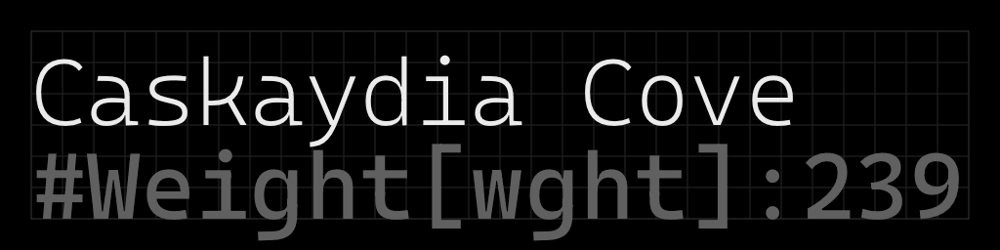
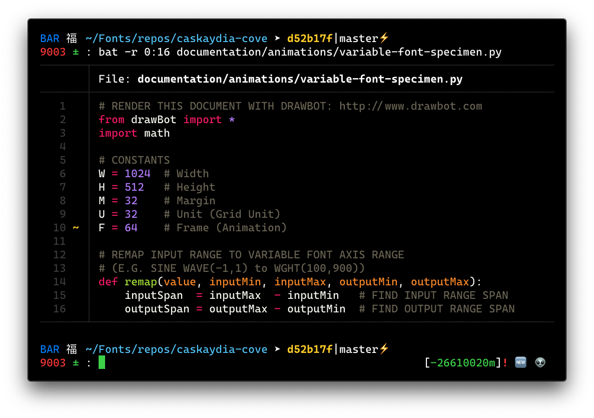

# Caskaydia Cove
Cascaydia Cove is a fork of [Cascadia Code]() with a few adjustments to conform to the Google Fonts spec and the RFN removed.  The name comes from the Nerds Fonts project, which uses "Caskaydia Code" for its own patched version of Casdadia Code.

This fork is maintained by a Washingtonian working from the Pacific Northwest.

The Cascadia Code upstream project is designed by Aaron Bell and developed by the Windows Terminal Team. Thanks for the great work making coman-line workflows more beautiful and accesible Aaron and Microsoft! If you want to know more about the Windows Terminal procest, I recomend listening to this podcast episode or checking out the official windows terminal blog.

Below is a demo of the variable font version of typeface, Python source code fore this animation is here: [documentation/animations/variable-font-specimen.py](documentation/animations/variable-font-specimen.py)


And usage example with iTerm2 and bat.


Caskaydia Cove is licensed under the [SIL Open Font License Version 1.1](OFL.txt), please see the [OFL-FAQ.txt](OFL-FAQ.txt) file if you have any legal questions.

[Pull requests](https://github.com/eliheuer/caskaydia-cove/pulls) and new [issues](https://github.com/eliheuer/caskaydia-cove/issues) are welcome.

## Development

Build scripts and UFO source files are in the [sources](sources) directory.

To build new fonts, open a Unix-like terminal (Linux, MacOS, WSL) in the root directory of this reporitory(where this readme is located). First make sure you have [Python3](https://www.python.org/) installed, then install the build scripts Python dependencies in a virtual enviroment.
```
which python3
python3 -m venv venv
source venv/bin/activate
which python3
pip install --upgrade pip
pip install --requirement requirements.txt
```
Then, run the buildscript from the root directory.
```
sh build.sh
```
If you are making a pull request to Google Fonts, add the `-gf` flag and files will be moved to `~/Google/fonts/ofl/..` after building.
```
sh build.sh -gf
```
